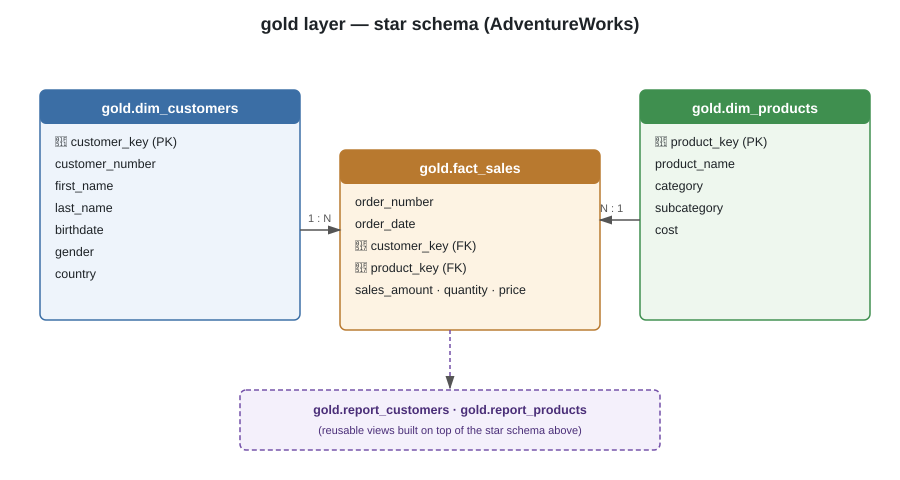

# AdventureWorks SQL Business Intelligence Analysis


A structured, SQL-only business intelligence analysis of the AdventureWorks
dataset — exploring sales trends, customer behavior, and product performance
using window functions, CTEs, and reusable reporting views. Every insight in
this project, from raw exploration to the final reporting views, is produced
entirely in T-SQL — no external BI tool, notebook, or scripting language is
used at any stage.

## Table of Contents

- [Overview](#overview)
- [Data Model](#data-model)
- [Key Business Questions Answered](#key-business-questions-answered)
- [Sample Insights](#sample-insights)
- [Project Structure](#project-structure)
- [Key SQL Techniques Used](#key-sql-techniques-used)
- [How to Run](#how-to-run)
- [Known Limitations](#known-limitations)
- [About This Project](#about-this-project)
- [Author](#author)

## Overview

This project delivers a structured SQL-based analysis of the AdventureWorks
dataset, a fictional bicycle manufacturer and retailer. It moves in three
deliberate stages — **explore → analyze → report** — progressing from raw
schema discovery to reusable, production-style reporting views, all
expressed as plain T-SQL.

- **Source:** Microsoft AdventureWorks (fictional company: Adventure Works Cycles)
- **Domain:** Bicycle manufacturing and retail
- **Scope:** Products, customers, and sales transactions across multiple years

## Data Model

The analysis sits on top of a small star schema: one fact table
(`gold.fact_sales`) surrounded by two dimension tables (`gold.dim_customers`,
`gold.dim_products`). The two reporting views built in this project
(`gold.report_customers`, `gold.report_products`) sit on top of that schema.



Full column-level definitions and every business rule (segmentation
thresholds, age groups, derived metrics) are documented in
[`docs/data_dictionary.md`](./docs/data_dictionary.md).

## Key Business Questions Answered

| # | Question | Script |
|---|----------|--------|
| 1 | For each product, is this year's sales above or below its historical average, and did it grow or decline compared to last year? | [`09_performance_analysis.sql`](./scripts/02_analysis/09_performance_analysis.sql) |
| 2 | How do cumulative sales and average price evolve year over year? | [`08_cumulative_analysis.sql`](./scripts/02_analysis/08_cumulative_analysis.sql) |
| 3 | How many customers are VIP, Regular, or New based on spending and loyalty? | [`10_data_segmentation.sql`](./scripts/02_analysis/10_data_segmentation.sql) |
| 4 | What does the complete behavioral and demographic profile of each customer look like? | [`12_report_customers.sql`](./scripts/03_reports/12_report_customers.sql) |
| 5 | Which countries show unusually high purchasing intensity relative to their customer base size? | [`06_ranking_analysis.sql`](./scripts/02_analysis/06_ranking_analysis.sql) |
| 6 | Which product categories generate revenue disproportionately high relative to their share of the product catalog? | [`11_part_to_whole_analysis.sql`](./scripts/02_analysis/11_part_to_whole_analysis.sql) |

## Sample Insights

> **Note:** the figures below are placeholders. Run the scripts referenced
> against your own restored AdventureWorks instance and replace each `[TODO]`
> with the actual result — real, sourced numbers are far more convincing to
> a reader than generic ones.

- **Customer loyalty:** `[TODO]`% of customers are classified as VIP, yet
  they contribute `[TODO]`% of total revenue *(source: `10_data_segmentation.sql`)*.
- **Category efficiency:** the `[TODO]` category has the highest
  `revenue_efficiency_ratio`, meaning it earns a disproportionately large
  share of revenue relative to its share of the catalog *(source: `11_part_to_whole_analysis.sql`)*.
- **Market intensity:** `[TODO]` shows the highest quantity purchased per
  customer, indicating stronger buying intensity than larger markets
  *(source: `06_ranking_analysis.sql`)*.
- **Product performance:** `[TODO]`% of products are classified as
  High-Performers, generating `[TODO]`% of total product revenue
  *(source: `13_report_products.sql`)*.

## Project Structure

```
adventureworks-sql-analysis/
│
├── docs/
│   ├── erd.svg                          # Entity relationship diagram
│   └── data_dictionary.md               # Business rules & metric definitions
│
├── scripts/
│   ├── 01_exploratory/
│   │   ├── 01_database_exploration.sql  # What tables/columns exist?
│   │   ├── 02_dimensions_exploration.sql# Unique categorical values
│   │   ├── 03_date_range_exploration.sql# Time boundaries of the data
│   │   └── 04_measures_exploration.sql  # Headline numeric KPIs
│   │
│   ├── 02_analysis/
│   │   ├── 05_magnitude_analysis.sql    # Scale across dimensions
│   │   ├── 06_ranking_analysis.sql      # Top/bottom performers
│   │   ├── 07_change_over_time_analysis.sql # Monthly trends
│   │   ├── 08_cumulative_analysis.sql   # Running totals, moving average
│   │   ├── 09_performance_analysis.sql  # YoY & historical-avg comparison
│   │   ├── 10_data_segmentation.sql     # VIP/Regular/New, cost ranges
│   │   └── 11_part_to_whole_analysis.sql# Category revenue contribution
│   │
│   └── 03_reports/
│       ├── 12_report_customers.sql      # gold.report_customers view
│       └── 13_report_products.sql       # gold.report_products view
│
├── LICENSE
└── README.md
```

## Key SQL Techniques Used

- **Window functions:** `RANK()`, `LAG()`, `SUM() OVER()`, `AVG() OVER(PARTITION BY ...)`
- **CTEs** for modular, readable, multi-step query design
- **Date functions:** `DATETRUNC()`, `DATEDIFF()`, `YEAR()`
- **Business logic via `CASE WHEN`** for segmentation and classification
- **Reusable reporting views (`CREATE VIEW`)** as a stable interface for downstream tools
- **Defensive division** (`NULLIF`, zero-guard `CASE` expressions) to avoid divide-by-zero errors on edge-case data

## How to Run

1. Restore the AdventureWorks database on SQL Server (or point the `gold`
   schema references at your own equivalent star schema).
2. Run the scripts **in folder order**: `01_exploratory` → `02_analysis` →
   `03_reports`. Within each folder, run in numeric filename order.
3. Query `gold.report_customers` and `gold.report_products` — created by the
   scripts in `03_reports/` — for the consolidated, reusable reporting layer.

## Known Limitations

- The customer-segmentation `CASE` logic is duplicated between
  `10_data_segmentation.sql` and `12_report_customers.sql` rather than
  centralized in one place (e.g. a scalar function). This was a deliberate
  trade-off to keep each script fully self-contained and runnable on its
  own — the trade-off is that the two need to be kept in sync manually if
  the thresholds ever change.
- All monetary values are treated as a single currency; the dataset carries
  no currency code.
- Recency/age/lifespan figures are computed relative to `GETDATE()`, so they
  will shift over time rather than stay pinned to a fixed reporting date.

## About This Project

`[TODO — a few sentences in your own words: why you chose this dataset, what
you found most interesting or challenging, what you'd add next (e.g. a
stored procedure to refresh the reports, or a data-quality test suite).]`

## Author

**Parnaz Ali**
[LinkedIn](https://www.linkedin.com/in/parnaz-ali-90767a248) · [GitHub](https://github.com/ParnazAli)
